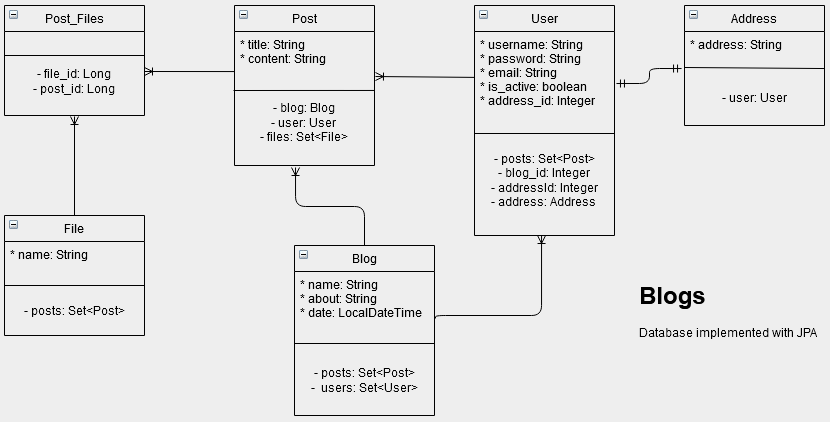

# Chapter 3 of [*Rapid Java Persistence and Microservices*](https://www.apress.com/9781484244753)

What we learned in this chapter was: 
- Structure a DB using JPA with different associations
- The use of Lombok
- Which involves the use of cascade and orphanremoval

##  This is how the DB looks

